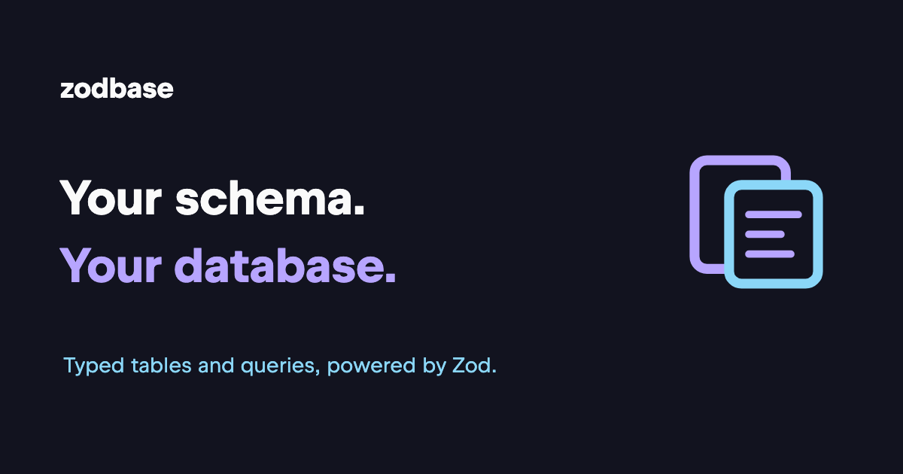

[](https://zodbase.knownquantity.net/)

[](LICENSE)

**Zod schemas become typed database tables.** Validate writes, build queries with typed field bindings, and connect through database adaptors.

Zodbase is under active development and does not yet provide a stable public API.

```bash
bun add zodbase zod
```

## A small example

Define a table, insert a row, and query it with Bun's built-in SQLite driver:

```typescript
import { Database as SQLite } from "bun:sqlite";
import { z } from "zod";
import { createTable, Database, metaStore, primaryKey } from "zodbase";
import BunSqliteAdaptor from "zodbase/adaptors/bun-sqlite";

const Users = createTable({
  id: "users",
  schema: z.object({
    id: z.string().meta(metaStore([primaryKey()])),
    name: z.string(),
  }),
});

const driver = new SQLite(":memory:");
const db = new Database({ adaptor: new BunSqliteAdaptor({ driver }) });

await db.syncTable(Users);
await db.insert(Users, { id: "ada", name: "Ada" });

const { results } = await db.select(Users, ["*"])
  .where(Users.$name.equals("Ada"));

console.log(results); // [{ id: "ada", name: "Ada" }]
driver.close();
```

## Keep going

- [Getting started](https://zodbase.knownquantity.net/) — installation and setup.
- [Tables and schemas](https://zodbase.knownquantity.net/tables-and-schemas/) — validation, keys, and schema synchronization.
- [Queries](https://zodbase.knownquantity.net/queries/) and [mutations](https://zodbase.knownquantity.net/mutations/) — reading and writing data.
- [Database adaptors](https://zodbase.knownquantity.net/adaptors/) — connection examples and database-specific behavior.
- [API at a glance](https://zodbase.knownquantity.net/reference/) — a hand-written overview of the public surface.
